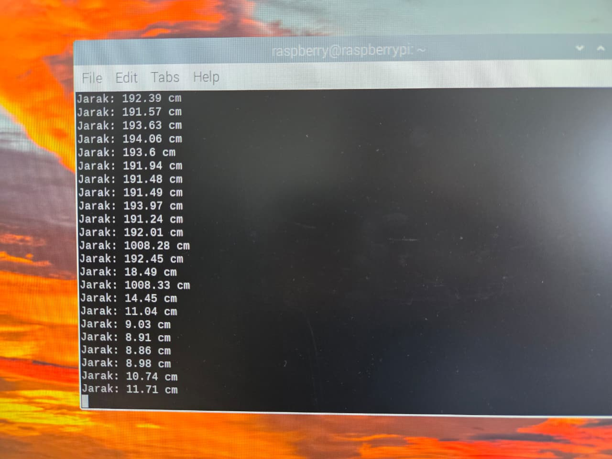
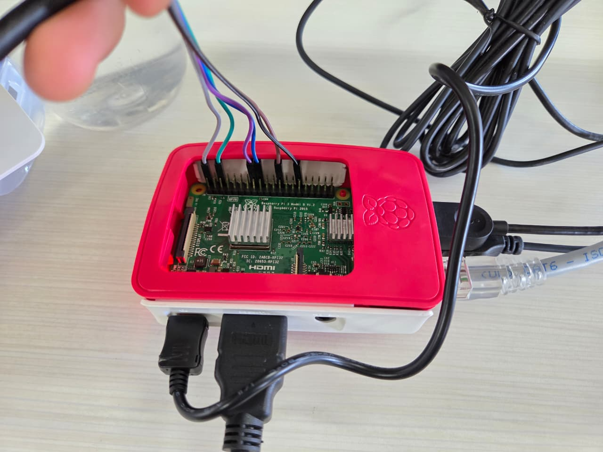
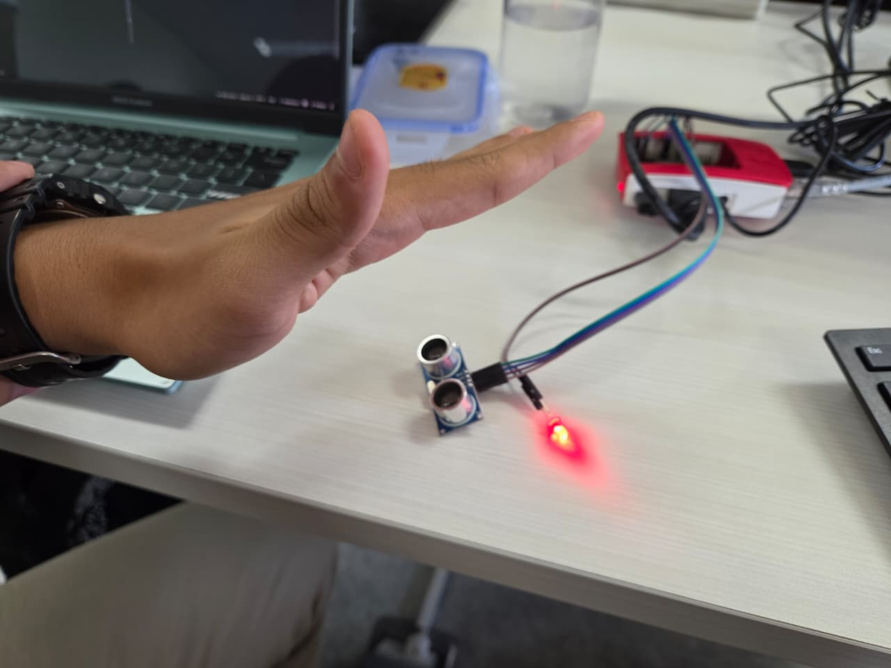
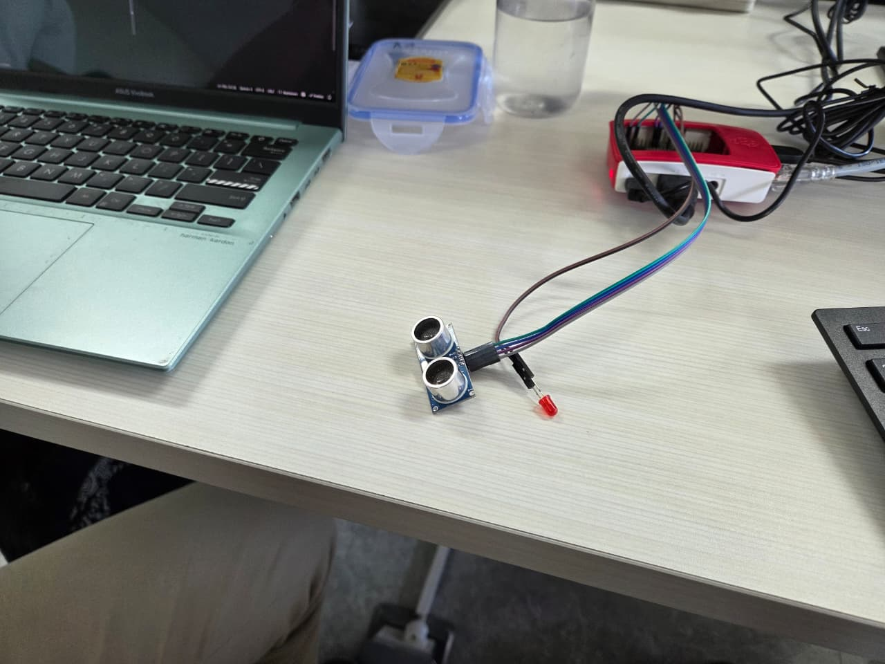

# Laporan Tugas IoT

## Sensor Jarak yang dihubungkan ke Raspberry
Proyek ini berfungsi untuk mengukur jarak yang kemudian dikirimkan ke Terminal pada Raspberry. Apabila jarak yang diterima sensor kurang dari 20 cm, maka Lampu Led akan menyala.

## 👥 Anggota Kelompok

| No | Nama                        | NRP         |
|----|-----------------------------|-------------|
| 1  | Imam Mahmud Dalil Fauzan    | 5027241100  |
| 2  | Christiano Ronaldo Silalahi | 5027241025  |

## ⚙️ Komponen yang Digunakan
1. Raspberry Pi 4
2. Sensor HC-SR04
3. Lampu LED
4. Kabel Female-to-Female (6 buah)

## 🛠️ Langkah-langkah
### Pemasangan Komponen (Wiring)

| Komponen           | Pin Komponen | Terhubung ke Pin ESP32 | Keterangan               |
| :----------------- | :----------- | :--------------------- | :----------------------- |
| **Sensor HC-SR04** | `VCC`        | `3V3`                  | Sumber daya              |
|                   | `GND`        | `GND`                  | Ground                   |
|                   | `TRIG`       | `GPIO 23`              | Pin Trigger              |
|                   | `ECHO`       | `GPIO 24`              | Pin Echo                 |
| **LED Merah**      | `Anoda (+)`  | `GPIO 8`               | Pin LED yang lebih Panjang.      |
|                   | `Katoda (-)` | `GND`                  | Ground                   |


## 🌐 Kode Program
Buat file `jarak_led.py` di Terminal Raspberry Pi, dengan command:
```bash
nano jarak_led.py
```
Lalu salin kode berikut:

```python
import RPi.GPIO as GPIO
import time

# Setup mode GPIO
GPIO.setmode(GPIO.BCM)
GPIO.setwarnings(False)

# Definisikan pin
TRIG = 23
ECHO = 24
LED = 8

# Setup pin
GPIO.setup(TRIG, GPIO.OUT)
GPIO.setup(ECHO, GPIO.IN)
GPIO.setup(LED, GPIO.OUT)

def get_distance():
    # Kirim sinyal TRIG
    GPIO.output(TRIG, True)
    time.sleep(0.00001)
    GPIO.output(TRIG, False)

    # Tunggu ECHO mulai
    while GPIO.input(ECHO) == 0:
        pulse_start = time.time()
    # Tunggu ECHO selesai
    while GPIO.input(ECHO) == 1:
        pulse_end = time.time()
    # Hitung durasi pulse
    pulse_duration = pulse_end - pulse_start
    distance = pulse_duration * 17150  # Kecepatan suara
    distance = round(distance, 2)
    
    return distance

try:
    while True:
        dist = get_distance()
        print(f"Jarak: {dist} cm")
        
        if dist < 20:
            GPIO.output(LED, GPIO.HIGH)  # Nyalakan LED
        else:
            GPIO.output(LED, GPIO.LOW)   # Matikan LED
        
        time.sleep(0.5)

except KeyboardInterrupt:
    print("Dihentikan oleh pengguna")
    GPIO.cleanup()
```
Kemudian Jalankan file tersebut dengan command
```bash
python3 jarak_led.py
```

[File Kode Program `jarak_led.py`](src/jarak_led.py)
## 📷 Dokumentasi
1. **Output di Terminal**

   

2. **Dokumentasi Fisik**
   
   
   
   